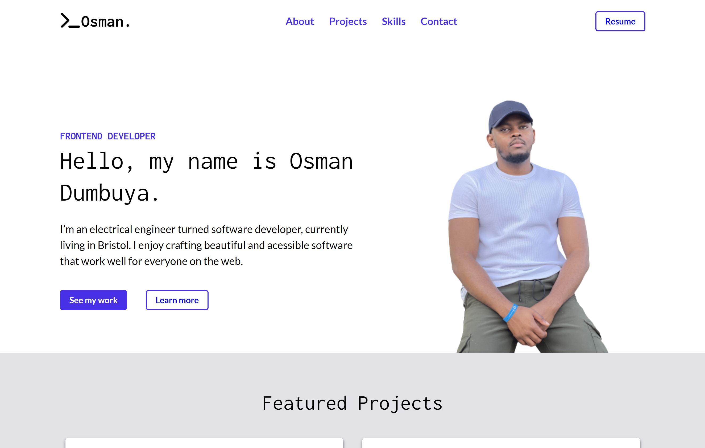

# Personal Portfolio Page

Built and Designed by Osman Dumbuya usig: HTML and CSS

## Description

This repo contains the source code to my personal portfolio which will be updated as I cover more concepts of web development. It will initially serve as my solution to the Module 2 - Personal Portfolio Challenge of Trilogy Skills Front-End Development Boot Camp. The project provide evidence of my ability to design and code a user friendly single page website that can be accessed by anyone with an internet connection.

This is demonstrated by adhering to accessibility standards such as [Semantic HTML](https://www.w3schools.com/html/html5_semantic_elements.asp) with concise CSS selectors, so that the site is optimized for search engines.

In doing so:

- Semantic HTML elements can be found throughtout the source code.
- All HTML elements follow a logical structure independent of their styling and positioning.
- All the images and icons contain accesibile [alt](https://www.w3schools.com/tags/att_img_alt.asp) attributes to provide alternative information if a user cannot view it on the website, due to slow connection, or an error in the image/icon location, or if the user uses a screen reader.
- The headings fall in sequential order.
- Title elements are concise and descriptive.
- CSS variables were used throughout.

## Usage

Visit this github page [link](https://osmantolo.github.io/OsmanPortfolio/) to access the website. You can navigate through the different sections of the page by clicking the links in the top navigation bar.

## Credits

Trinity Skills Front-End Bootcamp
